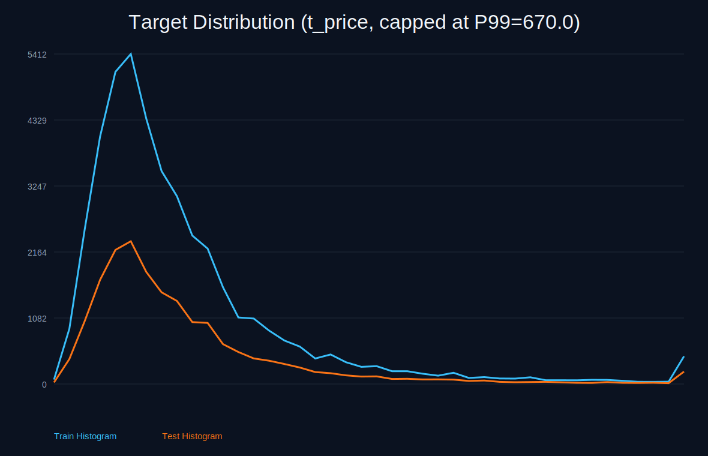
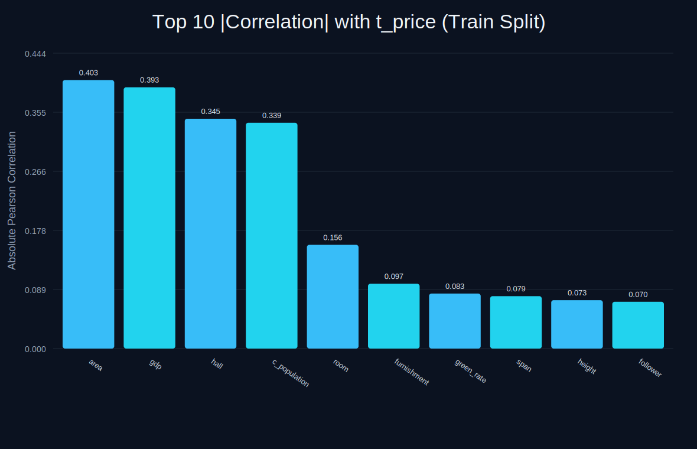
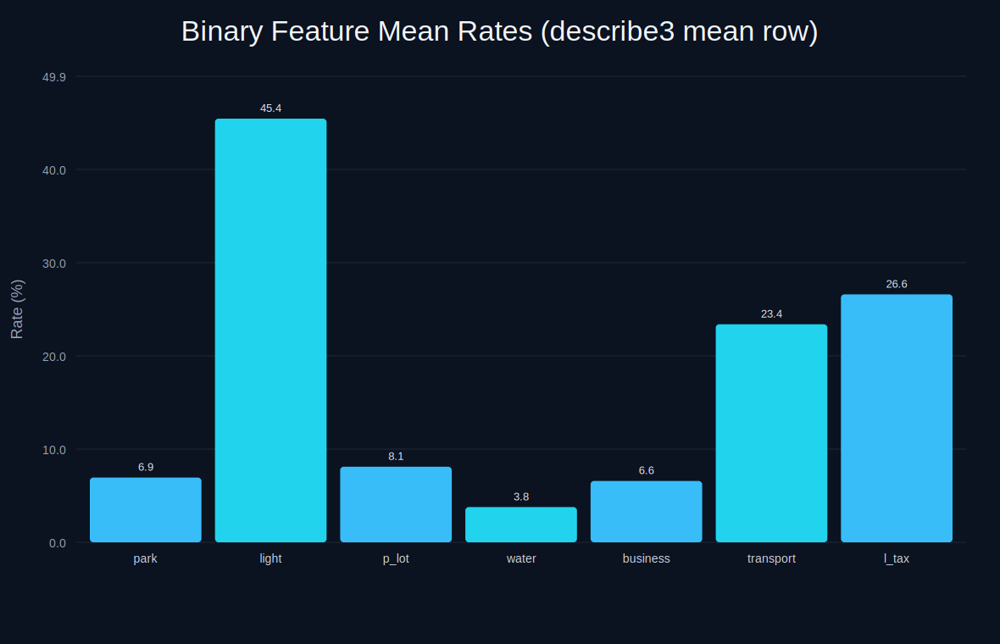
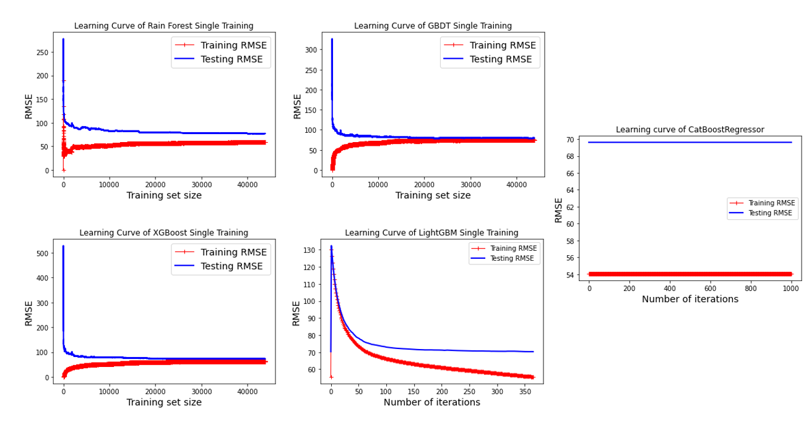
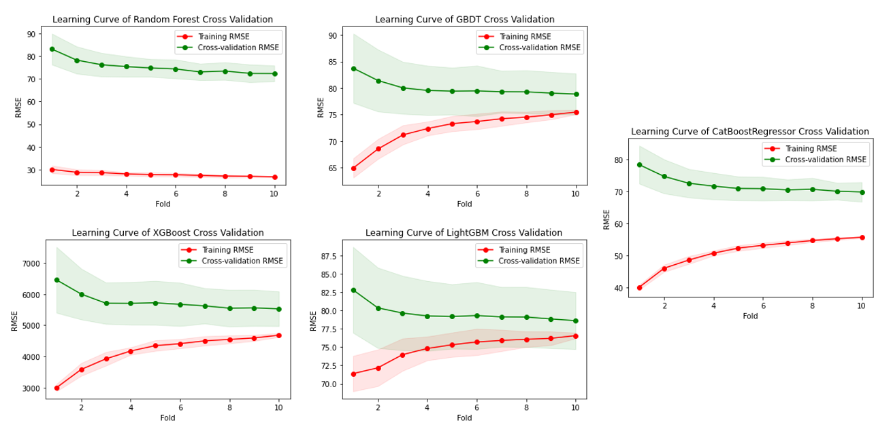
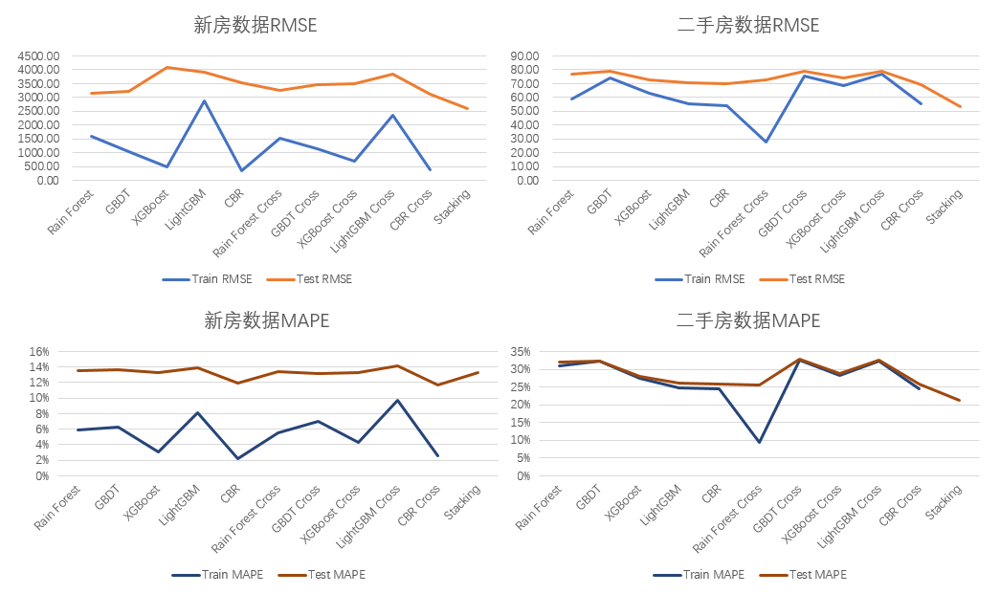
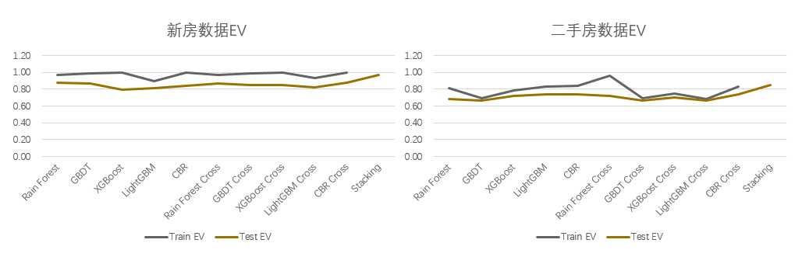

# Property Pledge Appraisement ML

Machine learning project for estimating real-estate pledge/collateral value in a commercial banking risk context.

This repository is an archived graduation-era project (originally built around 2022).  
I kept the original research assets and added portfolio-friendly documentation and English references.

## Portfolio Summary

- Goal: build a data pipeline from web-crawled housing data to collateral value prediction.
- Domain focus: second-hand housing plus macro city features for bank lending risk analysis.
- Main modeling families: Random Forest, GBDT, XGBoost, LightGBM, CatBoost, and Stacking.
- Data collection cutoff (original project): `2022-11-27`.

## Key Results (from saved notebook outputs)

Representative test-set metrics captured in notebooks:

- Nationwide/new-house style pipeline (`code/Modelling.ipynb`)
  - XGBoost test: `RMSE 6104.62`, `MAE 3903.14`, `R² 0.59`, `MAPE 29.00%`.
- Second-hand-house main pipeline (`code/Modelling_secondHand.ipynb`)
  - XGBoost test: `RMSE 72.36`, `MAE 38.46`, `R² 0.72`, `MAPE 28.04%`.
  - LightGBM test: `RMSE 70.31`, `MAE 36.76`, `MAPE 26.13%`.
  - Stacking (meta-model) test snapshots include: `RMSE 52.91`, `MAE 27.81`, `MAPE 21.68%`.

Notes:
- Metrics are reported exactly as stored in historical notebook outputs.
- Some old experiments may contain leakage or overfit behavior; treat the stack results as exploratory unless revalidated.

## Data Snapshot

From legacy cleaning notes:

- Raw merged records: `394,081`.
- After rule-based filtering + de-duplication: `267,305` unique records.
- Example training split artifacts:
  - `DataSet/training/train_data_second.csv` -> `43,817` rows
  - `DataSet/training/test_data_second.csv` -> `18,781` rows (including header line in row-count)

Main feature groups include:
- Property attributes: rooms, halls, area, orientation, furnishing, floor level, building structure.
- Market/liquidity hints: follower count, listing duration.
- City/macro variables: GDP, region, green coverage, urban population, built-up area, water resources.
- Text-derived tags: tax benefit, transit convenience, nearby business district, water view, parking, lighting, park proximity.

## Repository Structure

- `code/`: core notebooks for crawling, cleaning, feature engineering, model training, and stacking.
- `DataSet/`: raw/intermediate/final datasets.
- `runProcess/`: selected figures/docs from model workflow.
- `doc/`: historical thesis materials (contains personal/private files; not recommended for public release).
- `docs/`: added English helper docs for portfolio readability.

## Visualizations

Target distribution (`t_price`) comparison for train vs test:



Top 10 absolute correlations with target (`t_price`) from training split:



Binary tag mean rates:



Single-training learning curves (second-hand data):



Cross-validation learning curves (second-hand data):



Model metric comparison (RMSE and MAPE):



Model metric comparison (Explained Variance):



## Quick Start

1. Create environment:

```bash
python -m venv .venv
source .venv/bin/activate
pip install -r requirements.txt
```

2. Launch notebooks:

```bash
jupyter lab
```

Optional: regenerate dataset-driven SVG charts from `doc` data:

```bash
python3 scripts/generate_portfolio_charts.py
```

3. Suggested notebook order:
- `code/crawlData.ipynb`
- `code/cleanData.ipynb`
- `code/Modelling_secondHand.ipynb`
- `code/Modelling.ipynb`
- `code/stacking_model_chatgpt.ipynb` (optional quick stacking demo)

## Chinese -> English Aids

To keep original files intact while improving readability:

- English-translated notes:
  - `DataSet/data_description_en.txt`
  - `DataSet/data_cleaning_log_en.txt`
  - `DataSet/random_forest_notes_en.txt`
- File/folder translation map:
  - `docs/file_name_translation_zh_to_en.md`
- English alias copies for key files:
  - `code/lianjia_city_pagecount_output.ipynb`
  - `runProcess/decision_tree_feature_selection_part.png`
  - `runProcess/decision_tree_feature_selection.pdf`
  - `runProcess/random_forest_sklearn_output.docx`
