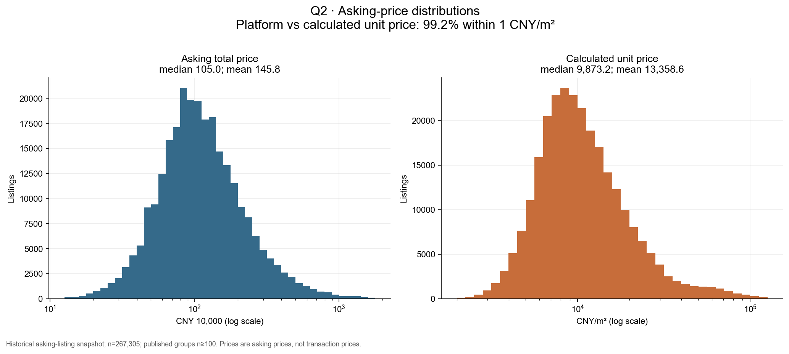
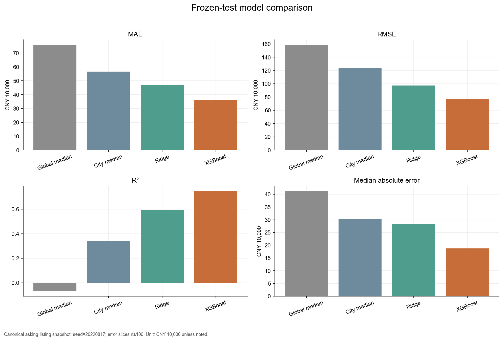
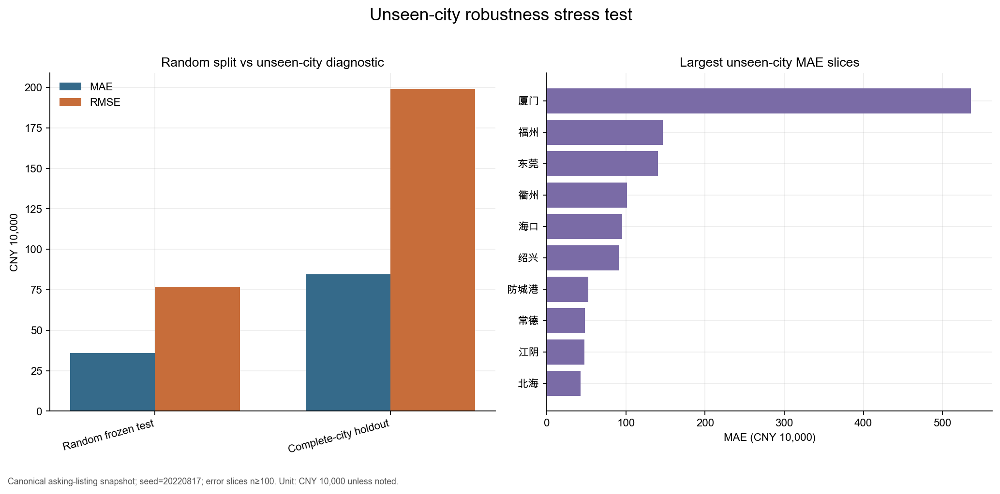

# Housing Price Intelligence for Collateral Valuation Support

**An end-to-end housing market analytics and price-modeling system designed to provide scalable market-price evidence for residential collateral appraisal.**

Built from **~394K historical residential listings collected across 135 cities**, the project combines multi-city web acquisition, deterministic data preparation, SQL market analytics, leakage-controlled regression, and geographic stress testing. The refreshed analytical pipeline operates on **267,305 second-hand listings** and estimates asking-price references from property and city characteristics.

| Data scale | Predictive performance | Geographic stress test |
|---|---|---|
| **~394K collected → 267,305 analytical listings** | XGBoost MAE **35.96**, **36.5% lower** than the city-median baseline; R² **0.749** | 19 unseen cities: MAE **84.51** (**2.35×**) |

The model provides a market-price reference for valuation support rather than a certified appraisal value.

## 1. Business Context

Residential collateral appraisal depends on consistent local housing-market evidence. Manual comparable-property analysis becomes difficult to scale across many cities, property segments, and price levels.

This project builds a data-driven valuation-support layer: acquire a broad listing snapshot, convert it into structured market evidence, estimate an asking-price reference, and identify cases where automated estimates are least reliable and professional review matters most.

## 2. What I Built

| Layer | Implementation | Evidence |
|---|---|---|
| Data acquisition | Custom historical multi-city listing collection and card-parsing workflow | ~394K collected records across 135 cities; [acquisition boundary](docs/acquisition_history.md) |
| Data quality | Deterministic filtering, categorical normalization, and analytical deduplication | `300,397 → 298,146 → 267,305` reproducible preparation lineage |
| Market analytics | SQLite/SQL and Python analysis across five fixed business questions | [aggregate findings](reports/findings.md) and [summary JSON](reports/summary.json) |
| Price modeling | Leakage-controlled city-median, Ridge, and XGBoost evaluation | 40,104-row frozen test; [model metrics](reports/model_metrics.csv) |
| Reliability analysis | Segment-level error slicing and complete-city holdout | 39,967 listings from 19 held-out cities; [error slices](reports/model_error_slices.csv) |

## 3. End-to-End Pipeline

```text
Historical multi-city listing acquisition (~394K)
        ↓
Data cleaning & quality controls
        ↓
267,305 analytical listings
        ↓
SQL market analytics
        ↓
Leakage-controlled price modeling
        ↓
Segment error + geographic stress testing
        ↓
Market-price reference for collateral valuation support
```

## 4. Market Intelligence

The analytical layer answers five fixed questions covering market coverage, price distributions, property segments, city structure, and platform-observed listing signals.

- **Asking prices are strongly right-skewed.** Median total asking price is 105.0 versus a mean of 145.8, with P10/P90 of 49.8/268.0 in CNY 10,000 units.
- **City price structure remains highly heterogeneous within a narrower segment.** For 60–90 m², 2–3-room listings, eligible city median unit prices range from 3,822 to 54,545 CNY/m² (groups require n ≥ 100).
- **Area changes total and unit-price structure differently.** Median total asking price rises from 52.5 in the <60 m² segment to 185.0 in the 144+ m² segment, while median unit price is not monotonic across area buckets.
- **A data-quality check exposed model leakage risk.** For 99.2% of rows, platform unit price differs from `asking price / area` by no more than 1 CNY/m². Both platform and calculated unit-price fields are therefore excluded from modeling as target-derived leakage.



Detailed definitions and limitations are generated in [Analytics v1 Findings](reports/findings.md).

## 5. Valuation-Support Price Model

The target is historical asking total price. Errors below are reported in CNY 10,000 units on the frozen test set.

| Model | MAE | RMSE | R² | Median AE |
|---|---:|---:|---:|---:|
| Global training median | 75.87 | 158.40 | -0.069 | 41.20 |
| City training median | 56.63 | 124.18 | 0.343 | 30.20 |
| Ridge | 47.19 | 97.29 | 0.597 | 28.41 |
| XGBoost | **35.96** | **76.72** | **0.749** | **18.76** |

**XGBoost reduced MAE by 36.5% relative to the city-median reference.**

Only nine property/location features enter the models: `city_id`, `rooms`, `halls`, `area_sqm`, `orientation_primary`, `furnishing`, `floor_level`, `total_floors`, and `building_type`. Target-derived unit-price fields, price buckets, identifiers, platform signals, macro fields, and title flags are excluded.



## 6. Where Automated Valuation Needs Human Review

Aggregate performance hides material reliability differences across segments:

- **High-value listings:** the 500+ asking-price bucket has MAE 245.28 and median absolute percentage error 27.6% (n=1,044).
- **Large properties:** the 144+ m² bucket has MAE 76.14 (n=5,251).
- **Geographic shift:** complete-city holdout increases XGBoost MAE from 35.96 to 84.51, a 2.35× degradation.
- **Largest city holdout error:** Xiamen has MAE 536.22 on 2,298 listings. Mean signed error is -536.22 and median signed error is -387.31, showing strong systematic underestimation in this held-out city.

These diagnostics suggest a natural valuation-support boundary: use model estimates as market references for covered property segments, while unusual, high-value, or geographically unfamiliar cases warrant stronger manual appraisal.



See the complete [Modeling Slice 3 Findings](reports/modeling_findings.md) and machine-readable [error slices](reports/model_error_slices.csv).

## 7. Evaluation Design

- One deterministic split assigns 187,089 rows to training, 40,112 to validation, and 40,104 to the frozen test; target quantile bins are used only for split assignment.
- Numeric scaling and categorical encoding are fit on training data only; unseen categories are handled without refitting.
- The same nine-feature allowlist is enforced for every model, with target-derived price fields explicitly excluded.
- Validation is reserved for XGBoost early-stopping monitoring; early stopping did not trigger within the configured 800 rounds.
- The frozen test was disclosed only after fitting, and no further model tuning occurred.
- A separate stress test holds out 19 complete cities from preprocessing, model fitting, and validation monitoring.
- Legitimate extreme observations remain in their assigned splits rather than being removed to improve metrics.

## 8. Reproducibility & Data Boundary

Real third-party row-level listings are not redistributed. The public repository provides the complete preparation/analytics/modeling code, synthetic fixtures, aggregate findings, metrics, and figures. Real inputs, derived rows, split assignments, and predictions remain under ignored `private_data/`.

Historical acquisition evidence is retained in the tested offline [`housing_analytics/acquisition.py`](housing_analytics/acquisition.py) module. It preserves the listing-card URL/parser boundary without performing live network collection.

Run the public synthetic path:

```bash
python3 -m venv .venv
source .venv/bin/activate
python -m pip install -r requirements-modeling.txt
python -m housing_analytics.analytics_v1 --source synthetic
python -m housing_analytics.run_analytics --source synthetic
python -m housing_analytics.run_modeling --source synthetic
python -m unittest discover -s tests -v
```

The real-data preparation contract and row-count lineage are documented in [Analytics Slice 1](docs/analytics_slice_1.md). Release constraints are documented in [Public Data Boundary](docs/public_data_boundary.md).

## 9. Repository Structure

```text
housing_analytics/   acquisition evidence, preparation, analytics, and model evaluation
analytics/sql/       five fixed market-analysis question sets
fixtures/            schema and invented row-level test data
tests/               lineage, leakage, split, output, and synthetic-path tests
reports/             aggregate market intelligence, metrics, error slices, and figures
docs/                data contract, acquisition history, and public-data boundary
private_data/        ignored real inputs, derived rows, splits, and predictions
```

## 10. Scope & Valuation Boundaries

- The target is historical asking price: a market-reference signal for valuation support, not a certified appraisal.
- The historical collection is not a probability sample or a temporal evaluation.
- The city holdout demonstrates geographic distribution shift but does not prove arbitrary new-city generalization.
- The original raw-to-canonical historical transformation is only partially recoverable from retained evidence.
- Raw third-party row-level records are not redistributed.
